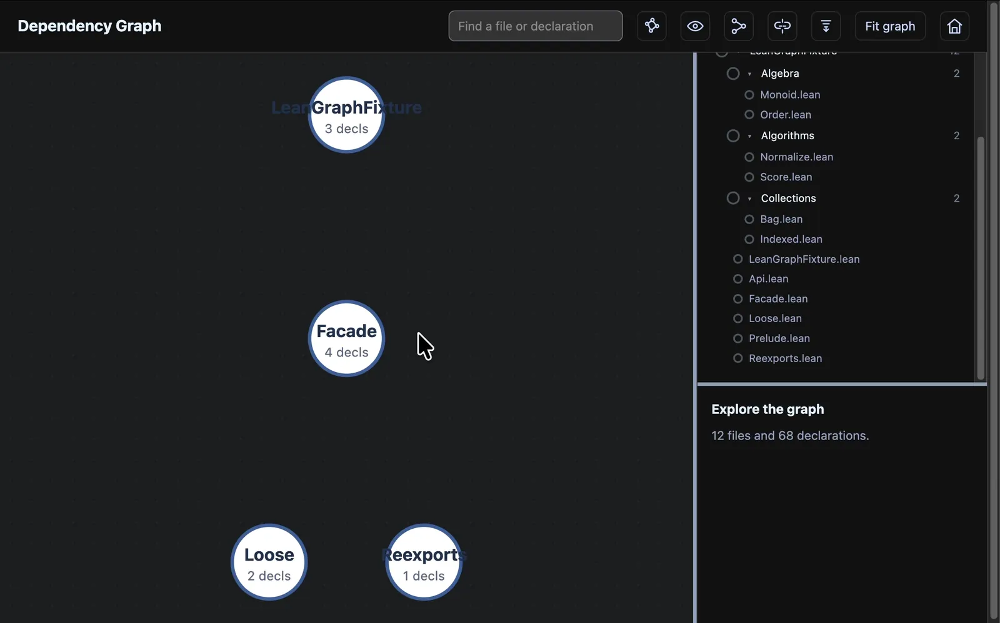
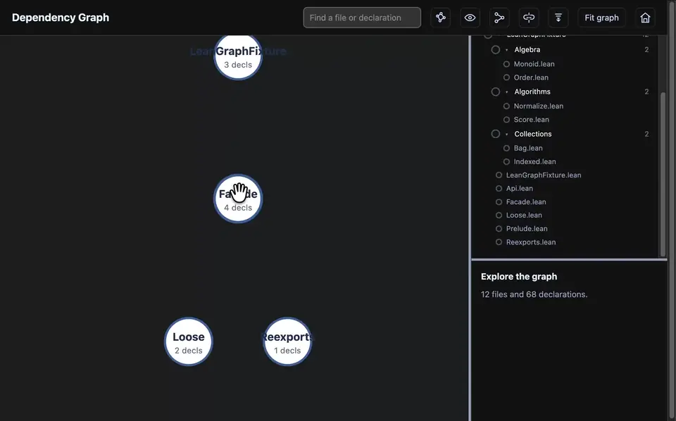
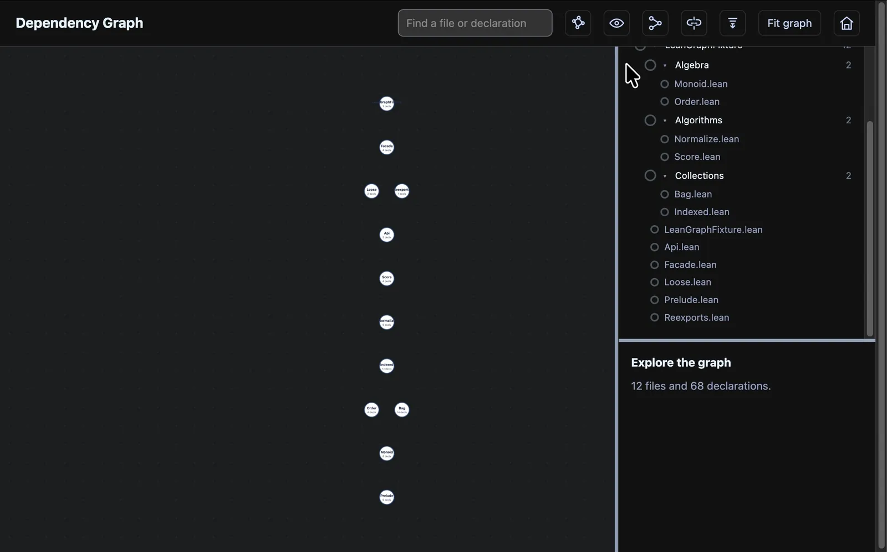
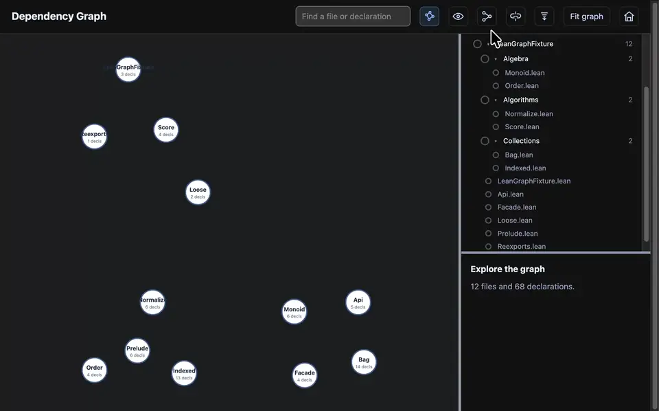
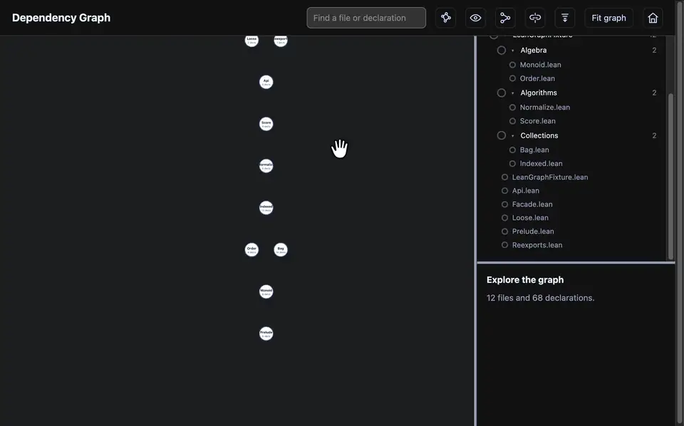
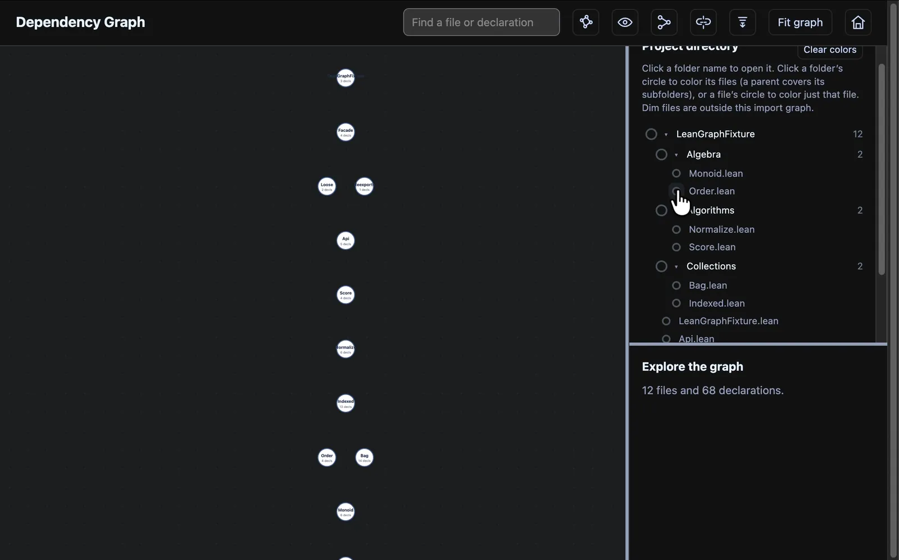
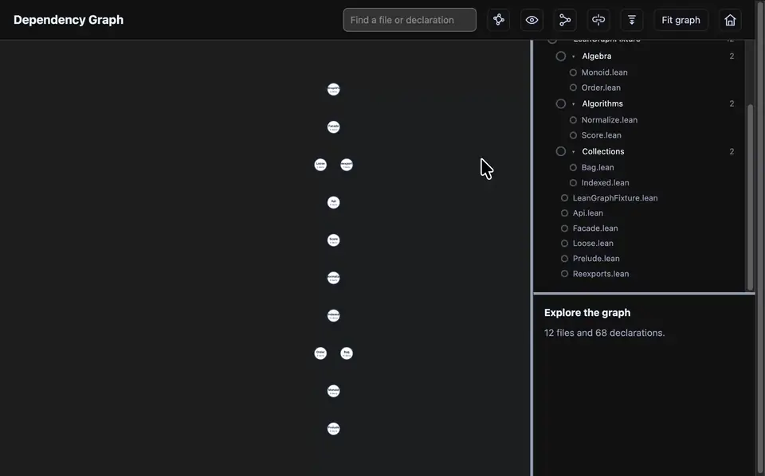
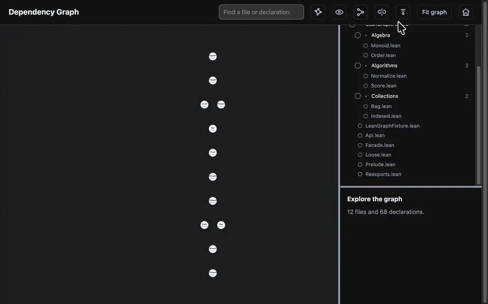
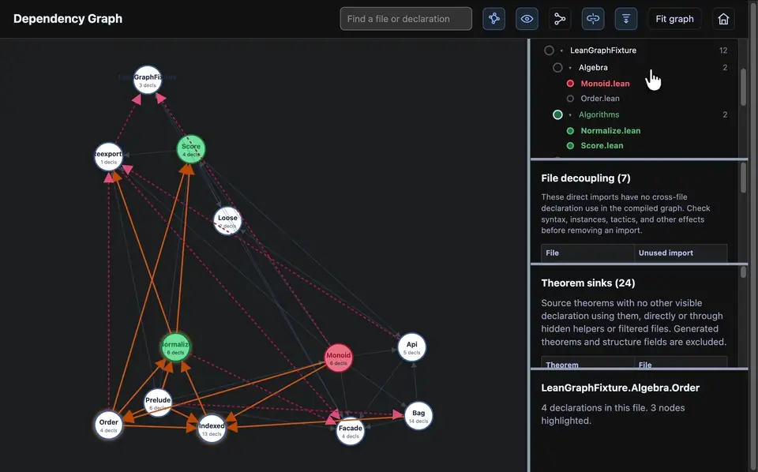

# Lean Import Graph Enhanced

A Lake package that turns a Lean project into a **self-contained, offline HTML
viewer** of its file imports *and* the declaration uses behind them. It is a
fork of [import-graph](https://github.com/leanprover-community/import-graph)
and keeps all of its exports and commands.

```bash
lake build
lake exe graph --to MyProject my_graph.html
```

## Features

Clips are recorded on the demo project in [`LeanGraphFixture/`](LeanGraphFixture/README.md).
Click one to open the full-resolution video.

**Select a file.** Click a file to highlight its imports and dependents. Arrows
point from prerequisite to dependent.

<a href="videos/single-click.mp4"></a>

**Expand a file.** Double-click a file to see its declarations. Select one to
see what it uses (teal) and what uses it (orange).

<a href="videos/double-click.mp4"></a>

**Show all connections.** The eye button draws every import and declaration use
at once.

<a href="videos/show-all-connections.mp4"></a>

**Connections between selected nodes.** Show only the arrows among the files you
select, or switch back to all of their connections.

<a href="videos/show-normal-connections.mp4"></a>

**Fit and cluster.** **Fit graph** brings everything back into view; the cluster
button groups closely connected files.

<a href="videos/fit-graph.mp4"></a>

**Color files and folders.** Click the circle next to a file or folder in the
sidebar to color it in the graph.

<a href="videos/color-files.mp4"></a>

**File-decoupling audit.** Lists direct imports whose declarations are never
used, as candidates to review (instances, syntax, and tactics may still need
them). Also available as `--file-decoupling report.md`.

<a href="videos/file-decoupling.mp4"></a>

**Theorem sinks.** Lists source theorems that nothing else uses; click one to
jump to it. Generated lemmas are excluded, which requires the project's `.lean`
sources.

<a href="videos/theorem-sink.mp4"></a>

**Reset.** The home button returns to the default view.

<a href="videos/back-to-default.mp4"></a>

The viewer also has search, keyboard navigation, and resizable panes. Arrows
follow uses through generated helpers and filtered files, so hidden steps don't
break the graph.

## Usage

```bash
lake exe graph --to MyProject my_graph.html        # or .dot, .gexf, .pdf, ...
lake exe graph --from MyProject.Sub --to MyProject my_graph.html
lake exe graph --to MyProject --file-decoupling report.md
```

See `lake exe graph --help` for all options. Graphviz is needed only for
formats other than `.dot`, `.gexf`, and `.html`.

The upstream Lean commands are included: `#redundant_imports`, `#min_imports`,
`#find_home`, and `#import_diff` (from `ImportGraph.Tools`), and
`lake exe unused_transitive_imports`.

To use it from another project, add to `lakefile.toml` and run `lake update`:

```toml
[[require]]
name = "importGraph"
git = "https://github.com/trzstony/lean-import-graph-enhanced.git"
rev = "main"
```

## Development

```bash
lake build && lake test
node --test --test-concurrency=1 tests/*.test.cjs
```

The viewer template is in [`html-template/`](html-template/README.md).

## Related projects

- [LeanDepViz](https://github.com/cameronfreer/LeanDepViz) and
  [Lean Atlas](https://github.com/NyxFoundation/lean-atlas): declaration graphs
  with `sorry`/axiom checks and review scoping.
- [lean-graph](https://github.com/patrik-cihal/lean-graph),
  [ProofFlow](https://github.com/Zhen-WushuiLingchun/lean_visualization), and
  [lean-library-graph](https://github.com/chenwydj/lean-library-graph):
  declaration-level dependency explorers.
- [leanblueprint](https://github.com/PatrickMassot/leanblueprint) and
  [LeanArchitect](https://github.com/hanwenzhu/LeanArchitect): blueprint
  dependency graphs for planning a formalization.

## License

Apache 2.0. The import analysis originated in Mathlib, and the HTML graph was
adapted from [Eric Wieser's Lean 3 import graph](https://github.com/eric-wieser/mathlib-import-graph).
See [`LICENSE`](LICENSE) and [`html-template/LICENSE_source`](html-template/LICENSE_source).
