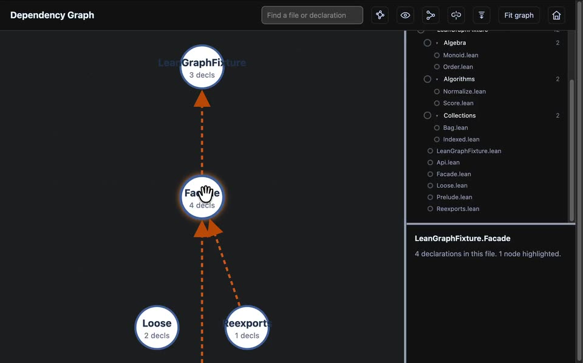
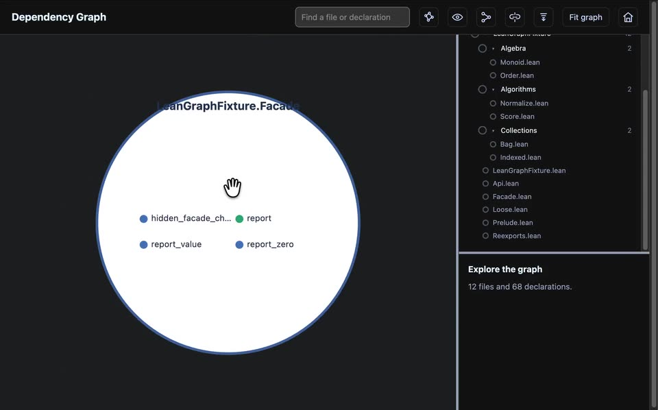
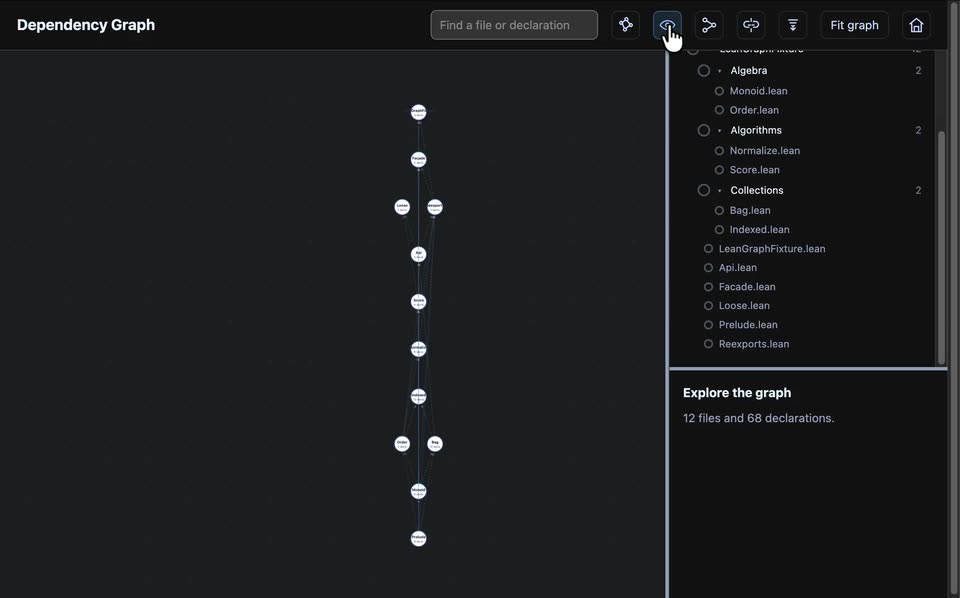
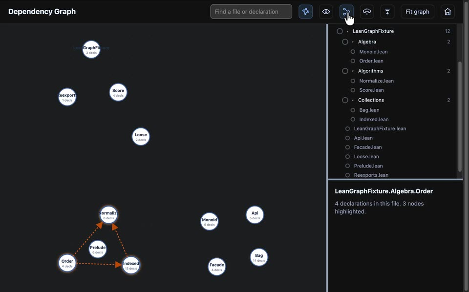
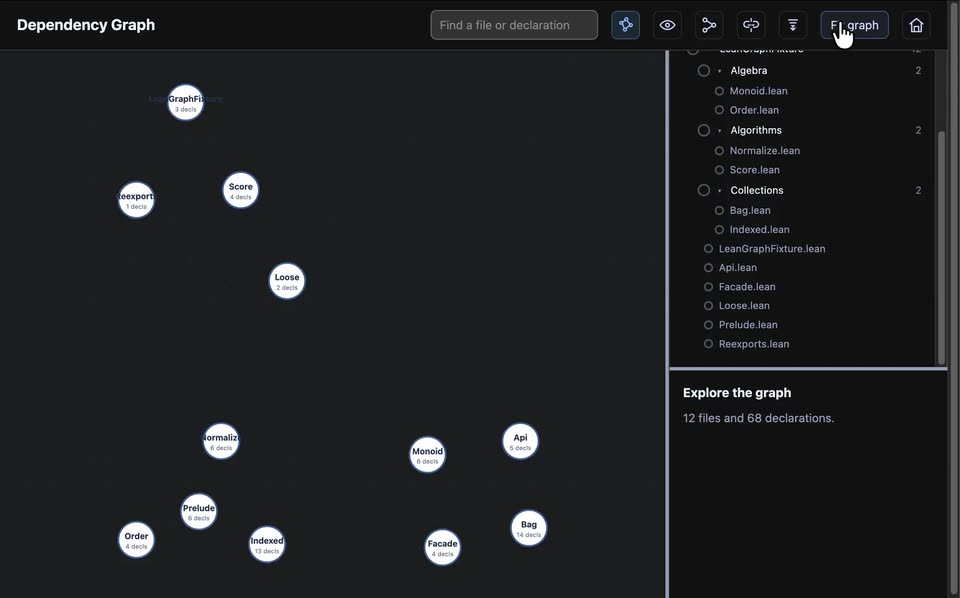
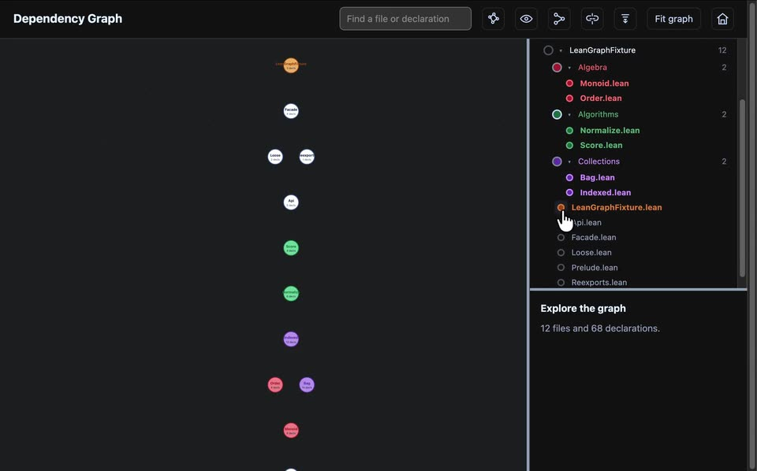
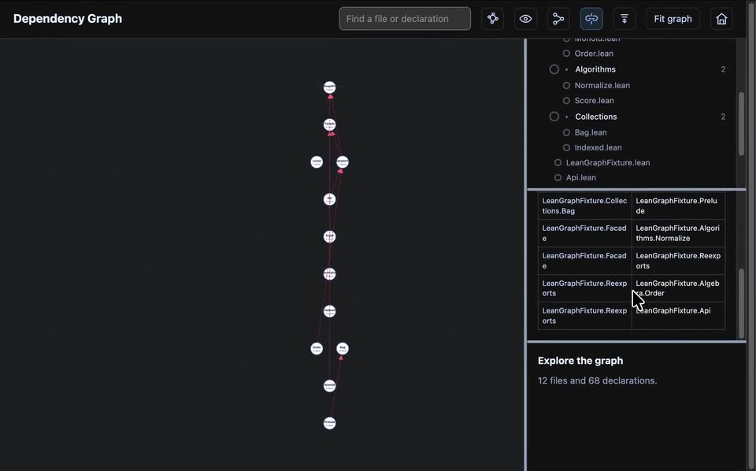
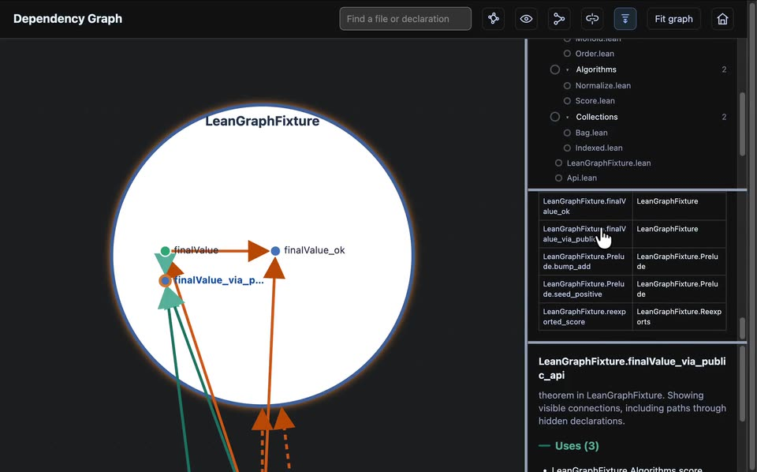
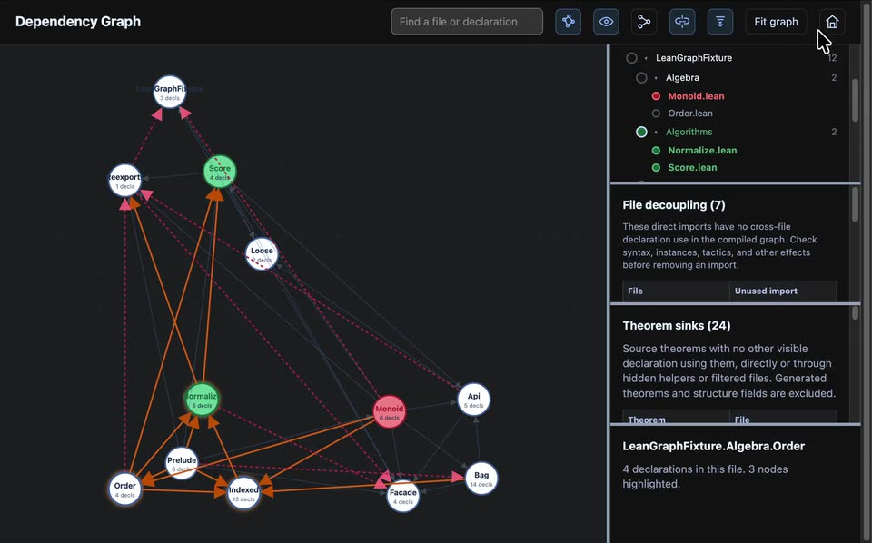

# Lean Import Graph Enhanced

`importGraph` is a Lake package for inspecting how a Lean project fits together.
It exports file-level import graphs like the community `importGraph` tool, and
adds a **self-contained, offline HTML viewer** that also shows the declarations
inside each file and the declaration uses that make an import necessary.

```bash
lake build
lake exe graph --to MyProject my_graph.html
open my_graph.html        # macOS; open it in any browser elsewhere
```

## Features

Every clip below was recorded on the small
[`LeanGraphFixture`](LeanGraphFixture/README.md) project in this repository.
**Click a picture to play its video.**

The toolbar, from left to right: cluster layout, show all connections,
connections between selected nodes, file-decoupling audit, theorem sinks,
**Fit graph**, and reset view.

### Select a file with a single click

[](videos/single-click.mp4)

Clicking a file circle selects it. Its imports and the files that depend on it
are drawn as highlighted arrows, and the details pane shows the file name and
how many declarations it contains. Click it again to clear the selection.
Arrows always point from the prerequisite to the file that depends on it.

### Expand a file into its declarations with a double click

[](videos/double-click.mp4)

Double-clicking a file opens it into a larger circle listing its definitions,
theorems, private lemmas, structures, and other declarations, colored by kind.
Double-click again to collapse it. Once a file is open you can select individual
declarations: teal arrows show what a declaration **uses**, orange arrows show
what **uses it**, and the details pane lists both.

### Show all connections

[](videos/show-all-connections.mp4)

The eye button toggles every import and declaration-use connection at once, for
a quick view of the whole project's shape. With it off, only the connections of
the current selection are drawn, which keeps large graphs readable.

### Connections between selected nodes vs. normal connections

[](videos/show-normal-connections.mp4)

With the "connections between selected nodes" button on, selecting several files
(here `Indexed`, `Normalize`, and `Order`) shows **only** the arrows among them,
so you can see exactly how a handful of files relate. The order you select them
in doesn't matter. Turn the button off to return to normal connections, where
every import and use of each selected file is shown. Expanding a selected file
in this mode replaces the file-level arrow with the individual theorem-level
connections.

### Fit the graph and switch to the cluster layout

[](videos/fit-graph.mp4)

Drag to pan around the graph. After zooming or panning away, **Fit graph**
brings every file back into view. The cluster button switches from the default
layered layout (dependencies at the bottom, dependents at the top) to a layout
that groups strongly connected files together while keeping circles apart.

### Color folders and individual files

[](videos/color-files.mp4)

The project directory in the sidebar mirrors your source tree. Click the circle
next to a **file** to color just that file, or next to a **folder** to color
every file inside it. A parent folder's color covers its subfolders, each new
color picks an unused palette entry, and the graph nodes change color to match.
**Clear colors** removes them all.

### Audit imports with file decoupling

[](videos/file-decoupling.mp4)

The link button opens the file-decoupling panel. It lists direct imports where
the importing file uses no declaration from the imported one in the compiled
environment, and highlights those import edges in the graph. These are
candidates for removal, not guarantees: syntax, instances, tactics, and
re-exports can still need an import, so review each one. The same table can be
written to Markdown from the command line with `--file-decoupling report.md`.

### Find theorem sinks

[](videos/theorem-sink.mp4)

The funnel button lists **theorem sinks**: source theorems that no other visible
declaration uses, directly or through hidden helpers and filtered files. These
are typically your end results, or leftovers worth reviewing. Click a row to
jump to the theorem: its file opens and its prerequisites are traced in the
graph.

<details>
<summary>How theorems are recognized</summary>

The exporter checks each theorem's name against an explicit `theorem` or
`lemma` header in the original source; a narrow source location alone does not
establish authorship, since generated lemmas can select attribute arguments.
Generated constructor, extensionality, and attribute lemmas stay hidden, and
structure projections are shown as fields. Generated helpers remain in the
support graph for dependency tracing.

This check needs compiled declaration ranges and matching `.lean` sources (found
through `LEAN_SRC_PATH` under `lake exe`). Missing sources produce a warning;
their theorems stay available for dependency tracing but are not listed as
sinks. Custom theorem-generating commands are conservatively treated as
generated; macros using the ordinary `lemma` spelling are supported. Sinks are
scoped to visible consumers: a use that exists only outside the displayed scope
does not by itself remove a theorem from the list. Rebuild after changing source
files, before exporting a graph.
</details>

### Reset to the default view

[](videos/back-to-default.mp4)

The home button undoes everything in one step: it clears selections, expanded
files, colors, open panels, and connection modes, and returns to the default
layered layout.

### Also in the viewer

- **Search** for a file or declaration from the toolbar.
- **Hidden-path tracing.** Arrows and the Uses / Used by lists follow paths
  through hidden declarations, such as generated proof helpers and filtered
  files, and stop at the next visible declaration. Hover over a connection or
  list item to see a shortest hidden path; direct references take precedence.
- **Support tracing.** Selecting a declaration can highlight every file that
  provides one of its transitive compiled prerequisites. Import-only files are
  not marked as support.
- **Resizable panes.** Drag the separator between the graph and the details
  pane, or the dividers between sidebar sections. Separators also respond to the
  arrow keys, Home, and End, and the layout stacks vertically on narrow screens.
- **Keyboard access.** Files and controls can be focused and activated without a
  mouse.
- **Works offline.** The generated `.html` file embeds the graph data and its
  JavaScript libraries, so it needs no web server or internet connection.

### Command line and Lean API

- **Graph exports.** `.dot`, `.gexf`, `.html`, or any format Graphviz supports.
- **Source-only analysis.** `ImportGraph.Imports.FromSource` parses imports
  directly from `.lean` files, so scripts and linters can inspect files before
  they are compiled.
- **Import-analysis commands.** `#redundant_imports`, `#min_imports`,
  `#find_home`, and `#import_diff` from `ImportGraph.Tools`, plus
  `lake exe unused_transitive_imports`.
- **Progress reporting.** Environment loading and declaration scans report
  progress in both interactive terminals and plain logs.

## Usage

Build the project first so Lean can load the target modules:

```bash
lake build
lake exe graph --to MyProject my_graph.html
```

Other outputs and filters:

```bash
lake exe graph --to MyProject my_graph.dot
lake exe graph --to MyProject my_graph.gexf
lake exe graph --to MyProject --file-decoupling file-decoupling.md
lake exe graph --from MyProject.Submodule --to MyProject my_graph.html
```

Run `lake exe graph --help` for every option, including `--include-direct`,
`--include-deps`, `--include-std`, `--include-lean`, `--mark-package`, and
`--mark-sorry`. Graphviz is only needed for formats other than `.dot`, `.gexf`,
and `.html`.

## Add it to another Lake project

```toml
[[require]]
name = "importGraph"
git = "https://github.com/trzstony/lean-import-graph-enhanced.git"
rev = "main"
```

Then run `lake update` and `lake exe graph ...`. Lean files that need the
analysis API can import:

```lean
import ImportGraph
import ImportGraph.Tools
import ImportGraph.Imports.FromSource
```

## Development

```bash
lake build
lake test
node --test --test-concurrency=1 tests/*.test.cjs
```

To try the viewer on the demo project, see
[`LeanGraphFixture/README.md`](LeanGraphFixture/README.md). The viewer template
lives in [`html-template/`](html-template/README.md). The test suite covers
import analysis, source parsing, the tool commands, the DOT exporter, and the
viewer's graph logic. Please include a focused test with changes that affect
those APIs or the generated graph data.

## Related projects

This project is a fork of
[leanprover-community/import-graph](https://github.com/leanprover-community/import-graph)
and keeps all of its exports, commands, and `lake exe` tools. Upstream's HTML
viewer shows files and their imports; this fork adds the declaration layer on
top: expanding a file into its declarations, tracing declaration uses through
hidden helpers and filtered files, and linking both levels in one offline page.

Other tools approach Lean dependencies from different angles and may suit you
better for some jobs:

- **Removing unused imports:**
  [`lake shake`](https://github.com/leanprover/lean4/blob/master/src/lake/Lake/CLI/Help.lean)
  ships with Lake. It accounts for every elaboration dependency, not only
  declaration uses, can explain why an import is needed (`--explain`), and can
  edit your files (`--fix`). The file-decoupling audit here is a visual way to
  review candidates, not a replacement for it.
- **Checking proofs are sound:**
  [LeanDepViz](https://github.com/cameronfreer/LeanDepViz) reports `sorry`,
  axiom use, and results from independent checkers per declaration, and
  [Lean Atlas](https://github.com/NyxFoundation/lean-atlas) separates statement
  from proof dependencies to narrow what a reviewer must read to trust a main
  theorem.
- **Exploring one theorem's neighborhood:**
  [lean-graph](https://github.com/patrik-cihal/lean-graph) and
  [ProofFlow](https://github.com/Zhen-WushuiLingchun/lean_visualization)
  focus on declaration-level dependency graphs, and
  [lean-library-graph](https://github.com/chenwydj/lean-library-graph) adds
  source panels and git-history coloring from a scan of the source files.
- **Planning a formalization:**
  [leanblueprint](https://github.com/PatrickMassot/leanblueprint) and
  [LeanArchitect](https://github.com/hanwenzhu/LeanArchitect) produce blueprint
  dependency graphs that link a mathematical write-up to its Lean declarations.

## License and attribution

Released under the Apache 2.0 license. The core import-analysis implementation
originated in Mathlib, and the original HTML graph was adapted from
[Eric Wieser's Lean 3 import graph](https://github.com/eric-wieser/mathlib-import-graph).
See [`LICENSE`](LICENSE) and [`html-template/LICENSE_source`](html-template/LICENSE_source)
for the corresponding notices.
